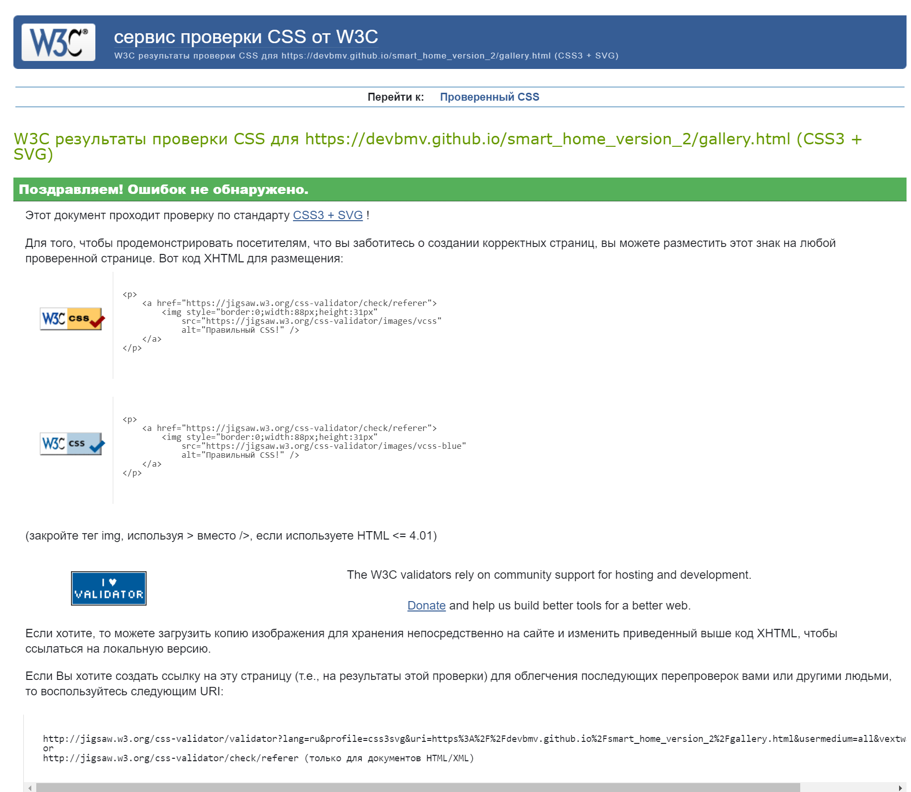
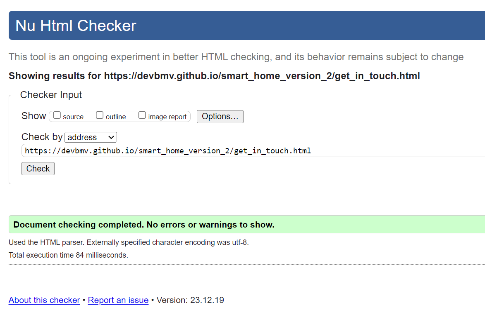

# Smart Home Documentation

Smart Home is a website designed to transform living spaces by integrating cutting-edge smart technologies. It provides seamless control over home automation, advanced security systems, and energy management solutions.
A Smart Home website can be useful for various audiences, including homeowners, technology enthusiasts, home automation professionals, potential buyers, and general audiences.

## Navigation Bar

- Section-navigation bar includes links to the Home page, Gallery, and Get in Touch page and is identical on all three pages to help users find information easily.

## The landing page image

- "As the saying goes, 'A picture is worth a thousand words.'
  A positive first video impression will provide a clear idea of the Smart Home presentation."

## Key Features section

- The "Key Features" section on a Smart Home website is crucial for highlighting the main capabilities and benefits of the smart home solutions offered.
- This section serves as a quick reference for visitors, showcasing what makes products or services on the site stand out.

## The Footer

- The footer section includes information like Contact Us, Privacy Policy, and Terms of Service.
- this information is a user-centric practice that enhances the overall functionality and user experience of the website. It demonstrates that the website is approachable and responsive, and values communication with its audience.

## Gallery

- The gallery page will provide the user with products and lifestyles associated with smart living.
- This section is valuable to the users, because it will engage and inspire them, and will provide valuable information through compelling visuals.

## The Get in Touch Page

- This page will allow the user to get in touch with the Smart Home site.
- The user will be asked to send their name and email address and leave a message

### Features Left to Implement

"The Smart Home project is continually evolving, and below is a list of features yet to be implemented:

1. **Integration with New Devices:** Adding support for additional devices, such as air quality sensors, humidity sensors, etc.

2. **Extended Automation:** Creating advanced automation scenarios to optimize the user experience within the smart home.

3. **Improved User Interface:** Enhancing the look and functionality of the user interface for a more intuitive experience.

We invite you to contribute and suggest new features.

## Testing

### Browser Compatibility

Our Smart Home project is designed to be compatible with modern web browsers.

- Google Chrome
- AVG Secure Browser
- Microsoft Edge

### Responsiveness

To ensure a seamless user experience across various devices, The project was tested and is responsive on different screen sizes including desktops, laptops, tablets, and mobile devices.

### Manual Functionality Testing

Manually tested the functionality of our Smart Home project by interacting with each component and feature. The buttons, links, and interactive elements respond appropriately. Checked for visual inconsistencies or layout issues.

### Validator Testing

- HTML

  - No errors were returned when passing through the official:  
    [Home Page HTML Validator](https://validator.w3.org/nu/?doc=https%3A%2F%2Fdevbmv.github.io%2Fsmart_home_version_2%2Findex.html) 
     

    [Gallery Page HTML Validator](https://validator.w3.org/nu/?doc=https%3A%2F%2Fdevbmv.github.io%2Fsmart_home_version_2%2Fgallery.html) 
     

    [Get in touch Page HTML Validator](https://validator.w3.org/nu/?doc=https%3A%2F%2Fdevbmv.github.io%2Fsmart_home_version_2%2Fget_in_touch.html) 
     

- CSS
  - No errors were found when passing through the official: 
    [Home Page CSS Validator](https://jigsaw.w3.org/css-validator/validator?uri=https%3A%2F%2Fdevbmv.github.io%2Fsmart_home_version_2%2Findex.html&profile=css3svg&usermedium=all&warning=1&vextwarning=&lang=ru) 
     
    [Home Page CSS Validator](https://jigsaw.w3.org/css-validator/validator?uri=https%3A%2F%2Fdevbmv.github.io%2Fsmart_home_version_2%2Fgallery.html&profile=css3svg&usermedium=all&warning=1&vextwarning=&lang=ru) 
     
    [Home Page CSS Validator](https://jigsaw.w3.org/css-validator/validator?uri=https%3A%2F%2Fdevbmv.github.io%2Fsmart_home_version_2%2Fget_in_touch.html&profile=css3svg&usermedium=all&warning=1&vextwarning=&lang=ru) 
     

### Lighthouse Audit

Our Smart Home project has been thoroughly tested using Google's Lighthouse audit tool to ensure high performance, accessibility, best practices, and search engine optimization. The results highlight the efficient design and responsive nature of the website, making it a reliable and user-friendly platform.

Here are the Lighthouse scores from our latest audit:

- **Performance**: 97
- **Accessibility**: 100
- **Best Practices**: 95
- **SEO**: 100
- **PWA**: Checked and confirmed

For a detailed breakdown and to understand more about what each metric means, you can view the full Lighthouse report by running the audit yourself in the Chrome browser's developer tools or visit the [Lighthouse website](https://developers.google.com/web/tools/lighthouse).

## Deployment

To deploy the Smart Home project, follow these steps:

1. Clone the repository to your local machine using the following command:

git clone https://github.com/devbmv/smart_home_version_2.git

### Media

- The videos used on the main page are from the YouTube user "Smart Home Solved." You can view them via the link below: 
  [Smart Home Solved](https://www.youtube.com/watch?v=yDNWVRmRHlY) 
- The photos used on the sign-up and gallery pages are from the website [Pixabay](https://www.pixabay.com).

## Known Issues

During the development and deployment of the Smart Home project, the following issues were identified and have been partially addressed. However, some issues may still persist on certain devices:

### Bugs:

- **Navigation Bar Overlap**: The navigation bar overlap issue has been improved on most devices, but may still persist on a few. *Status: Improved, monitoring for edge cases.*

- **Video Embed Stretching**: The video embed stretching issue has been largely resolved with responsive design techniques. *Status: Improved, minor issues may exist on uncommon screen sizes.*

- **Footer Displacement**: Efforts have been made to ensure the footer stays at the bottom of the page, but there may still be discrepancies on devices with unusual aspect ratios. *Status: Significantly improved, continuing to address remaining devices.*

### Accessibility Concerns:

- **Contrast Ratios**: Efforts to improve text contrast are underway, enhancing readability across the site. *Status: In progress, with ongoing adjustments.*

- **Missing Alt Texts**: Alt texts have been added to most images, with a few exceptions that are scheduled for the next update. *Status: Major improvements made, final touches pending.*

### Performance Optimization:

- **Slow Load Times**: Image compression and caching strategies have been implemented to improve load times. Some pages may still load slower than ideal. *Status: Performance enhanced, ongoing optimization.*

### General Recommendations:

- **Code Refactoring**: The codebase has undergone significant refactoring for better efficiency and readability, although continuous improvements are being made. *Status: Ongoing refactoring and optimization.*

## Contributing

We appreciate the community's contributions in further refining these improvements. If you would like to contribute to resolving the remaining issues or enhancing the Smart Home project, please visit [contributing guidelines](https://github.com/devbmv) and consider submitting a pull request.
